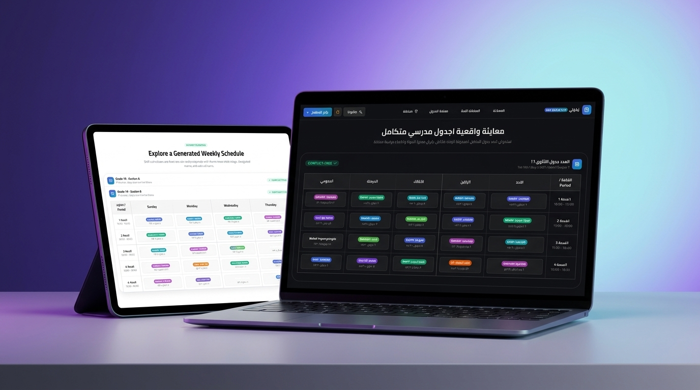

# 📅 Jadwali (جَدْوَلي) — Autonomous School Timetable Generator

<p align="center">
  
</p>

<p align="center">
  <strong>⚡ An autonomous, conflict-free school timetable generator & interactive scheduling platform powered by deterministic CSP algorithms.</strong>
  <br />
  <em>جَدْوَلي — المولّد الذكي للجداول المدرسية بنظام حل القيود الخوارزمي، خالي تماماً من التعارضات بخصوصية وسرعة فائقة.</em>
</p>

<p align="center">
  <a href="https://github.com/O2sa/Jadwali/actions/workflows/deploy.yml"></a>
  
  
  
  
  
  
</p>

<p align="center">
  🌐 <strong>Live Demo:</strong> <a href="https://o2sa.github.io/Jadwali/">https://o2sa.github.io/Jadwali/</a>
</p>

---

## 📖 About Jadwali (جَدْوَلي)

Manually crafting academic timetables that satisfy complex real-world institutional constraints—teacher availability, class periods, maximum daily workloads, room allocations, and subject spacing—is a tedious and error-prone puzzle.

**Jadwali (جَدْوَلي)** automates school timetable generation using an advanced deterministic **Constraint Satisfaction Problem (CSP)** engine featuring:

- **Backtracking with Forward Checking** for strict constraint pruning.
- **Minimum Remaining Values (MRV)** heuristic for optimal variable ordering.
- **Least-Constraining Value (LCV)** heuristic for value selection.

The platform is designed to be **100% local-first and client-driven**: all calculations run client-side inside Web Workers and persist locally in IndexedDB (zero cloud tracking, absolute institutional privacy), while also supporting an optional full-stack Express & MongoDB backend mode.

<p align="center">
  
</p>

---

## ✨ Key Capabilities

- ⚡ **Automated CSP Solver Engine**: Timetables are generated inside a dedicated background Web Worker using mathematically proven constraint resolution, ensuring conflict-free schedules and 60 FPS UI responsiveness.
- 🔒 **100% Client-Side Privacy**: All institutional data (teachers, classes, subjects, constraints, and schedules) stays securely on your machine in IndexedDB via Dexie.js. No telemetry or server dependencies required.
- 🌍 **Native Bilingual RTL & LTR Support**:
  - Full Arabic and English localization with automatic locale detection.
  - Native RTL/LTR transitions powered by Mantine's `DirectionProvider`.
  - Modern Arabic typography with Cairo and Tajawal Google fonts.
  - Interactive one-click language switcher in the header.
- 🌓 **Adaptive System Dark & Light Themes**:
  - Automatically honors system preferences (`prefers-color-scheme`) with manual toggle.
  - Elevated glassmorphic styling, high-contrast dark timetable matrix, and accessible status indicators.
- 📅 **Interactive Drag & Drop Timetable Matrix**:
  - Multi-view inspection: **Class Timetable**, **Teacher Timetable**, and **Master School Matrix**.
  - Move and swap lecture periods with real-time constraint validation, visual collision cues, and multi-step Undo/Redo.
- ⚙️ **Customizable Academic Calendar**:
  - Configurable working days per week (5, 6, or 7 days).
  - Flexible daily lecture periods (6 to 8 periods).
  - Teacher availability matrices, part-time schedules, and weekly workload capacity enforcement.
- 📤 **Multi-Format Universal Export**:
  - One-click export to formatted Excel spreadsheets, print-ready PDFs, and portable JSON backups.
- 🚀 **Automated GitHub Pages CI/CD**:
  - Continuous integration and deployment via GitHub Actions (`.github/workflows/deploy.yml`).
  - SPA 404 fallback routing for reliable direct link navigation.

---

## 🏗️ Architecture & Monorepo Structure

```text
Jadwali/
├── packages/
│   └── school-timetabling-engine/  # Standalone deterministic CSP solver package (CJS, ESM, d.ts)
├── client/                         # React 18 + Vite + Mantine UI v7 client
│   ├── src/
│   │   ├── api/                    # Data context (Local IndexedDB Dexie / Remote API)
│   │   ├── components/             # Reusable UI components, modals, and landing sections
│   │   ├── i18n/                   # Bilingual translations & RTL context
│   │   ├── layouts/                # Glassmorphic AppLayout & floating sidebar navigation
│   │   ├── pages/                  # LandingPage, Dashboard, Teachers, Classes, Generator, etc.
│   │   └── theme/                  # Brand tokens, colors, and dark mode styling
│   └── tests/                      # Vitest + React Testing Library test suite
├── server/                         # Optional Node.js + Express REST API
│   ├── controllers/                # Route controllers
│   ├── models/                     # Mongoose models (Teacher, Class, Subject)
│   └── populate.js                 # Sample database seeder
└── .github/workflows/deploy.yml    # GitHub Actions deployment to GitHub Pages
```

---

## 🚀 Getting Started

### Prerequisites

- [Node.js](https://nodejs.org/) (version 18 or later, Node 20 LTS recommended)
- [pnpm](https://pnpm.io/) (version 9 or later)

### Quick Start (Client / In-Browser Mode)

1. **Clone the repository:**

   ```bash
   git clone https://github.com/O2sa/Jadwali.git
   cd Jadwali
   ```

2. **Install dependencies:**

   ```bash
   pnpm install
   ```

3. **Start the development server:**

   ```bash
   pnpm --filter client dev
   ```

4. **Open your browser:**
   Navigate to `http://localhost:5173` to explore the landing page and start generating schedules.

---

### Optional: Full-Stack Mode with Express & MongoDB

If you prefer using a centralized database:

1. **Ensure MongoDB is running** (`mongodb://localhost:27017/school-scheduler`).
2. **Start the API server:**
   ```bash
   pnpm --filter server dev
   ```
3. **Run both concurrently:**
   ```bash
   pnpm dev:all
   ```

---

## 🧪 Testing & Verification

Run the full monorepo test suite (engine + client):

```bash
pnpm test
```

Run test suite for a specific package:

```bash
pnpm --filter client test
pnpm --filter school-timetabling-engine test
```

Typecheck and production build:

```bash
pnpm --filter client typecheck
pnpm build
```

---

## 🚢 Deployment

The repository includes a GitHub Actions workflow in `.github/workflows/deploy.yml` that builds and deploys the application to GitHub Pages on every push to `development` or `main`.

To enable it:

1. Go to **Settings** > **Pages** in your GitHub repository.
2. Under **Build and deployment** > **Source**, choose **GitHub Actions**.
3. Push to `development` or `main` to trigger the automated build and deployment.

---

## 📄 License

Distributed under the MIT License. See [LICENSE](./LICENSE) for more information.
