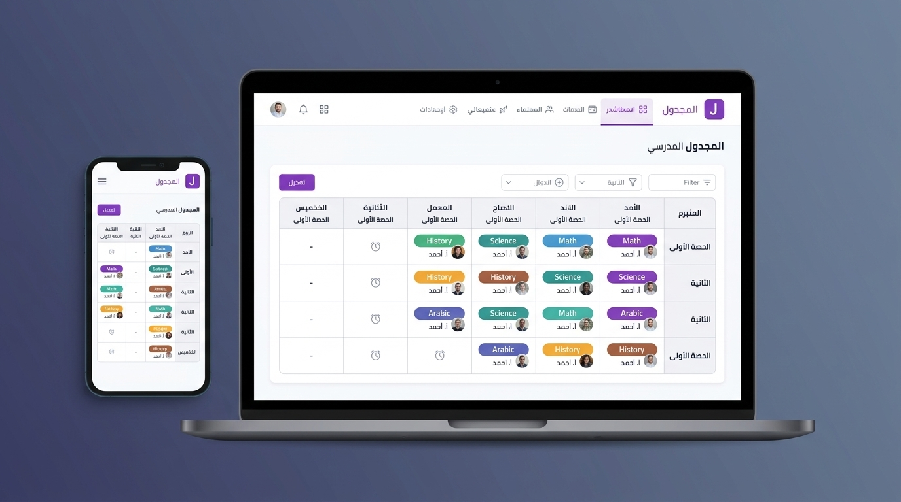

# 📅 School Schedule Generator

<p align="center">
  
</p>

<p align="center">
  <strong>⚡ An intelligent, conflict-free school timetable generator & interactive scheduling platform.</strong>
</p>

<p align="center">
  <a href="https://github.com/O2sa/school-schedule-generator/actions/workflows/deploy.yml"></a>
  
  
  
  
  
  
</p>

<p align="center">
  🌐 <strong>Live Demo:</strong> <a href="https://o2sa.github.io/school-schedule-generator/">https://o2sa.github.io/school-schedule-generator/</a>
</p>

---

## 📖 About The Project

Manually creating academic schedules that satisfy complex real-world constraints—teacher availability, class periods, maximum daily workloads, and subject quotas—is a tedious and error-prone puzzle.

**School Schedule Generator** automates academic scheduling using an intelligent constraint-satisfaction engine with forward checking, minimum remaining values (MRV), and least-constraining value (LCV) heuristics.

The platform is designed to be **local-first and client-driven**: it can run completely inside the browser using Web Workers and IndexedDB (no database setup required), while also supporting an optional full-stack Express & MongoDB backend mode.

---

## ✨ Key Features

- ⚡ **Background Solver Engine**: Timetables are generated inside a dedicated Web Worker using deterministic constraint backtracking, keeping the UI responsive at 60 FPS even during intensive calculations.
- 💾 **Local-First & Offline Ready**: All data (teachers, classes, subjects, constraints, and generated schedules) is saved locally in IndexedDB via Dexie.js. No server installation needed.
- 🌍 **Full Bilingual Localization (English & Arabic RTL)**:
  - Automatic system language detection (`navigator.language`) with Arabic priority.
  - Native RTL/LTR layout transitions powered by Mantine's `DirectionProvider`.
  - Modern Arabic typography with Cairo and Tajawal Google fonts.
  - Interactive language switcher in the navigation bar.
- 🌓 **Adaptive System Dark / Light Theme**:
  - Automatically matches system color scheme (`prefers-color-scheme`).
  - Refined high-contrast dark mode styling for timetable grids and teacher availability matrices.
  - Instant theme toggle in the header.
- 📅 **Interactive Timetable Editor & Multi-View**:
  - Responsive multi-view tabs: **Class Timetable**, **Teacher Timetable**, and **All Classes Master View**.
  - Interactive drag/swap of lecture slots with real-time constraint validation.
- ⚙️ **Customizable Academic Calendar**:
  - Configurable working days per week (5, 6, or 7 days).
  - Flexible lecture periods per day (e.g. 6 to 8 periods).
  - Fine-grained teacher availability slot matrix and weekly period capacity enforcement.
- 🚀 **Automated GitHub Pages CI/CD**:
  - Automated deployment workflow via GitHub Actions (`.github/workflows/deploy.yml`).
  - SPA 404 fallback routing for seamless page refreshes on GitHub Pages.

---

## 🏗️ Architecture & Monorepo Structure

```text
school-schedule-generator/
├── packages/
│   └── school-timetabling-engine/  # Standalone solver package (CJS, ESM, d.ts)
├── client/                         # React 18 + Vite + Mantine UI v7 frontend
│   ├── src/
│   │   ├── api/                    # Data context (Local IndexedDB or Server API)
│   │   ├── components/             # Reusable UI components & modals
│   │   ├── i18n/                   # Bilingual translations & RTL provider
│   │   ├── layouts/                # Responsive navigation & header shell
│   │   ├── pages/                  # Dashboard, Teachers, Classes, Generator, etc.
│   │   └── theme/                  # Mantine theme & dark mode tokens
│   └── tests/                      # Vitest + Testing Library test suite
├── server/                         # Optional Node.js + Express REST API
│   ├── controllers/                # Route controllers
│   ├── models/                     # Mongoose models (Teacher, Class, Subject)
│   └── populate.js                 # Sample database seeder
└── .github/workflows/deploy.yml    # GitHub Actions deployment to GitHub Pages
```

---

## 🚀 Getting Started

### Prerequisites

- [Node.js](https://nodejs.org/) (version 18 or later, Node 20 LTS recommended)
- [pnpm](https://pnpm.io/) (version 9 or later)

### Quick Start (Client / In-Browser Mode)

1. **Clone the repository:**
   ```bash
   git clone https://github.com/O2sa/school-schedule-generator.git
   cd school-schedule-generator
   ```

2. **Install dependencies:**
   ```bash
   pnpm install
   ```

3. **Start the client development server:**
   ```bash
   pnpm --filter client dev
   ```

4. **Open your browser:**
   Navigate to `http://localhost:5173` to use the application with local storage and Web Worker solving.

---

### Optional: Running Full-Stack with Server & MongoDB

If you wish to use the centralized MongoDB backend:

1. **Ensure MongoDB is running locally** (default `mongodb://localhost:27017/school-scheduler`).
2. **Start the server:**
   ```bash
   pnpm --filter server dev
   ```
3. **Run all services concurrently:**
   ```bash
   pnpm dev:all
   ```

---

## 🧪 Testing & Verification

Run the full monorepo test suite (engine + client):

```bash
pnpm test
```

Run test suite for a specific package:

```bash
pnpm --filter client test
pnpm --filter school-timetabling-engine test
```

---

## 📦 Building for Production

Compile all packages and generate optimized static assets for deployment:

```bash
pnpm build
```

The production bundle will be generated in `client/dist/`, complete with `index.html` and `404.html` ready for static hosting.

---

## 🚢 GitHub Pages Deployment

The repository includes a GitHub Actions workflow in `.github/workflows/deploy.yml` that automatically builds and publishes the website to GitHub Pages on every push to `development` or `main`.

To enable it:
1. Navigate to **Settings** > **Pages** in your GitHub repository.
2. Under **Build and deployment** > **Source**, select **GitHub Actions**.
3. Push to your repository to trigger the automated deployment.

---

## 🤝 Contributing

Contributions and ideas to enhance the constraint algorithm or UI are welcome!

1. Fork the Project
2. Create your Feature Branch (`git checkout -b feature/AmazingFeature`)
3. Commit your Changes (`git commit -m 'Add some AmazingFeature'`)
4. Push to the Branch (`git push origin feature/AmazingFeature`)
5. Open a Pull Request

---

## 📄 License

Distributed under the MIT License. See [LICENSE](./LICENSE) for more information.
